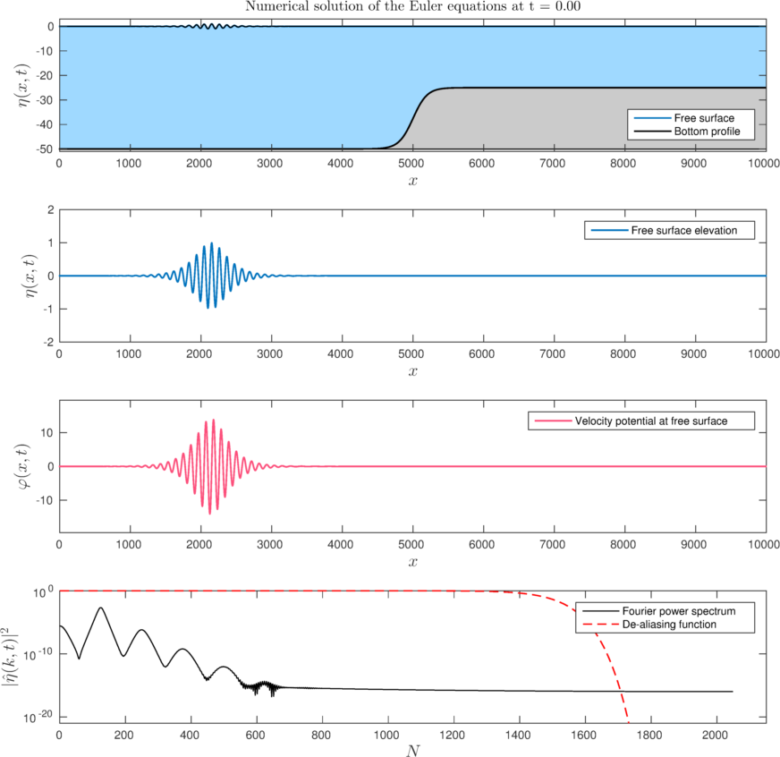

# Full Euler solver

The present Matlab code is an implementation of the full Euler equations solver based on the method of conformal variables. The pecularity here is that the solver works on general (but smooth) bottoms. The method is described in the reference given below.

## Reference:

* C. Viotti, **D. Dutykh**, F. Dias. *The conformal-mapping method for surface gravity waves in the presence of variable bathymetry and mean current*, Procedia IUTAM, **11**, 110 - 118, 2014

## Acknowledgements:

The author would like to thank Professor [Yury Stepanyants](https://staffprofile.usq.edu.au/profile/yury-stepanyants) (University of Southern Queensland, Australia) for bringing my attention to this problem.

---
